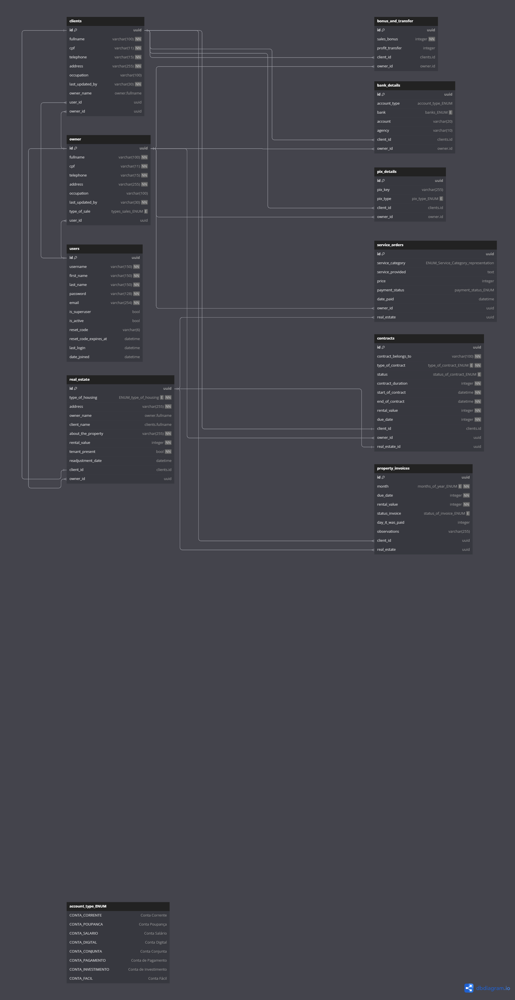

# IMOGIS - Imobiliária com Gestão Integrada de Sistema

O **IMOGIS** é um sistema desenvolvido em **Python Django** para gerenciamento de propriedades imobiliárias. Este projeto visa facilitar a gestão tanto dos proprietários dos imóveis quanto dos clientes que desejam alugar ou comprar propriedades. A administração dessas informações ficará a cargo do corretor de imóveis.

## Funcionalidades

- **`Cadastro de Usuários`**: Gerenciamento de usuários do sistema, incluindo corretores e administradores.
- **`Gerenciamento de Proprietários`**: Cadastro e atualização de informações dos proprietários de imóveis, incluindo dados pessoais e de contato.
- **`Cadastro de Clientes`**: Registro de informações dos clientes interessados em propriedades.
- **`Gestão de Imóveis`**: Cadastro de imóveis disponíveis para venda ou aluguel, incluindo detalhes como valor de aluguel, endereço, e status do imóvel.
- **`Contratos`**: Registro e controle dos contratos de aluguel e venda, incluindo status e datas relevantes.
- **`Faturas`**: Geração e controle de faturas relacionadas aos imóveis, com acompanhamento de pagamentos e pendências.

## Estrutura do Banco de Dados

O banco de dados é estruturado com as seguintes tabelas principais:

- **`Users`**: Armazena informações de usuários do sistema.
- **`Owner`**: Contém dados dos proprietários de imóveis.
- **`Clients`**: Registra informações dos clientes.
- **`Real Estate`**: Cadastro dos imóveis disponíveis.
- **`Contracts`**: Informações sobre contratos de aluguel e venda.
- **`Property Invoices`**: Controle de faturas relacionadas aos imóveis.

### Diagrama ER

Um diagrama de relacionamento entre as entidades foi criado para facilitar o entendimento da estrutura do banco de dados. Veja abaixo:



## Tecnologias Utilizadas

- **Python**: Linguagem de programação principal.
- **Django**: Framework web para desenvolvimento ágil.
- **PostgreSQL**: Sistema de gerenciamento de banco de dados relacional.
- **DBML**: Para definição da estrutura do banco de dados.

## Sobre como Executar o Projeto

### Pré-requisitos:

- Python 3
- Django
- PostgreSQL

---

### Inicialização e Instalação do projeto

1. Clone o repositório:

```bash
   git clone <url-do-repositorio>
   cd imogis
```

2. Crie um ambiente virtual e ative-o:

```bash
python -m venv venv
source venv/bin/activate  # Para Terminal Windows use: venv\\Scripts\\activate
```

3. Instale as dependências:

```bash
pip install -r requirements.txt
Configure o banco de dados no arquivo '.env.exemple'
```

4. Realize as migrações do banco de dados:

```bash
python manage.py migrate
```

Inicie o servidor de desenvolvimento:

```bash
python manage.py runserver
```
---

### Acesse o sistema no navegador: **http://127.0.0.1:8000/api/docs/swagger/**